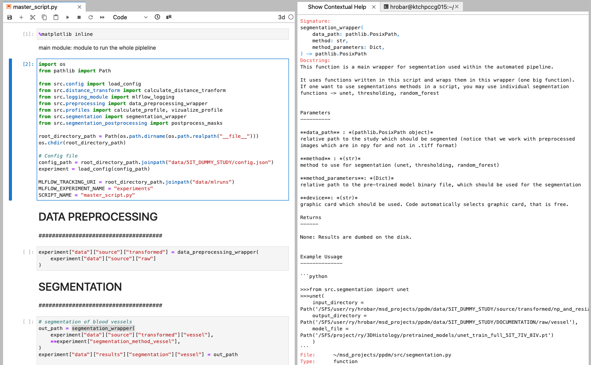

#### Code Usage

The code can be operated in 2 separated ways:

* 1) Fully automated pipeline
* 2) Manual Usage of Modules

** 1)Fully automated pipeline**

which analyzes the entire study automaticaly and logs the results (final biologic penetration profiles) into mlflow. 
(All steps e.g. segmented masks are stored on the hard disk).

This approach requires the usage of **config.json** file, which contains details regarding the pipeline settings [(see config page)](config.md).

Once the **config.json** is prepared, the code can be used via either of the two files bellow:

* **main.py** (Command line version)
* **master_script.py** (Script version which may be operated from jupyter lab or any other python IDE)

### main.py

this file used for the CommandLine (terminal) interface. This file shall be used when the entire analysis should be performed automaticaly and one in intested only in inspecting the results in *mlflow*.

Using a command line interface (terminal), the code can be run as:

::: main

### master_script.py

This file is a script version of `main.py` file. This means that it allows for interactive (cell-by-cell) usage.

** 2)Manual Usage of Modules**

One can choose to run modules individually - e.g. only for blood vessels segmentations/distance transform. This allows for the further customization of the code. This approach does not require the **config.json** file.

See the **Documentation of individual modules** for further details: [Preprocessing,](Modules/preprocessing.md) [Segmentation,](Modules/segmentation.md) [Postprocessing,](Modules/segmentation_postprocessing.md) [Distance Transform,](Modules/distance_transform.md) [Profiles.](Modules/profiles.md)

Even when using Modules individually, the function's documentation can still be accesed within the jupyterlab. When using **Contextual Helper** we see the functions documentation (see below).

