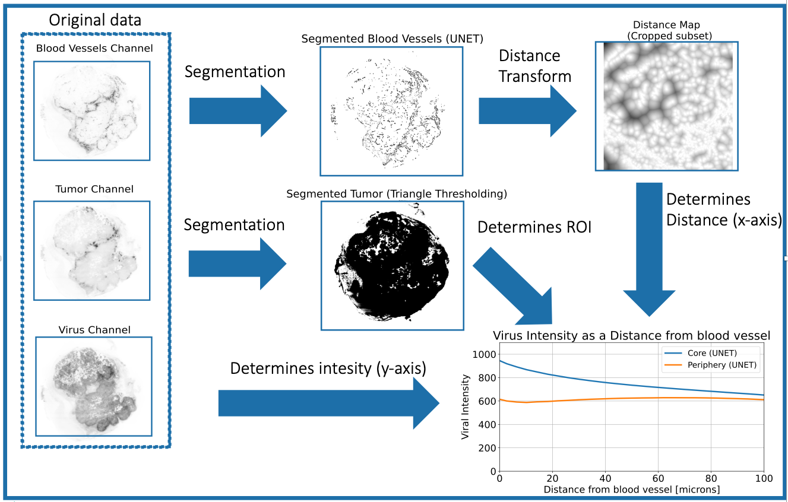

# Methodology Overview:  

A detailed description of the tumor lightsheet image analysis pipeline is provided in the methods section of the manuscript by Kumar et al. 2022. Briefly, this tumor lightsheet image analysis method comprised of four main steps that accomplish: 

**Goal: Analysis of of biologic penetration in intact/whole tumors in the context of vasculature using using 3D Histology (tissue clearing + lightsheet microscopy).**

Our lightsheet image analysis pipeline consisted of four main steps – Blood vessels segmentation, Tumour boundary segmentation, Vascular distance map creation, and Data aggregation, respectively. In this section, we describe each step of the pipeline individually

### Diagram of Our Pipeline
<!--  -->
<!--  -->

<!--  -->

## Analysis Pipeline Steps:

### Tumor blood vessel segmentation:
The fluorescence channel detecting CD31 +ve tumor blood vessels in lightsheet images is segmented in order to obtain binary masks of the vessels. The binary masks then enable further quatification of vascular volume in the tumor and measurement of drug penetration away from tumor vasculature. 

* Code implementation can be found in (**segmentation.py**) [see segmentation module documentation and examples](Modules/segmentation.md).

### Tumor boundary segmentation:
The fluorescence channel detecting Syto16 stained cell nuclei in lightsheet images is segmented to obtain a binary mask of the whole tumor to enable detection of the tumor boundary. The tumor region can also be divided into tumor core and periphery via further post-processing to enable comparison between physiologically relevant locations. 

* Code implementation can be found in (**segmentation.py**) [see segmentation module documentation and examples](Modules/segmentation.md).

### Vascular distance map creation: 
Following blood vessel and tumor tissue segmentation, we computed a distance map to characterize drug penetration from tumor blood vessels into neighboring tissue. In this step each pixel was assigned the distance to the nearest blood vessel. 

* Documentation and examples of distance transform module (**distance_transform.py**) script. [Documentation and examples of distance transfrom module](Modules/distance_transform.md).

### Collect and aggregate data:
In the final step of the tumor lightsheet data analysis pipeline, outputs from previous steps are aggregated to support interpretation. 

* [see profiles module documentation and examples](Modules/profiles.md).

#
#### Refs
[^1]: Dobosz, M., Ntziachristos, V., Scheuer, W. & Strobel, S. **Multispectral Fluorescence Ultramicroscopy: Three-Dimensional Visualization and Automatic Quantification of Tumor Morphology, Drug Penetration, and Antiangiogenic Treatment Response**. Neoplasia 16, 1-U24, doi:10.1593/neo.131848 (2014).*
